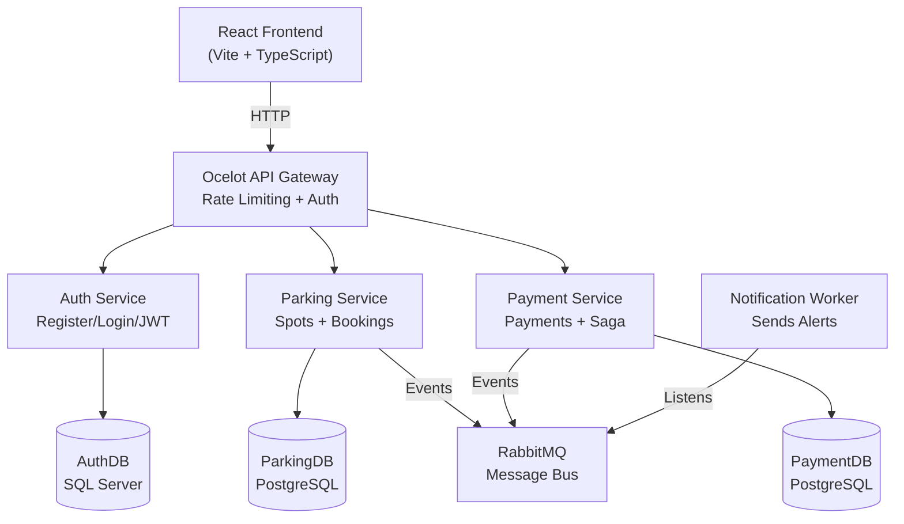

# 🅿️ SmartPark — Smart Parking Management System

## What Does This Solve?
Finding parking in cities is a REAL industrial problem. This system lets users:
- **Search** for available parking spots nearby
- **Book** a spot in advance
- **Pay** online
- **Get notified** when booking is confirmed or cancelled

> [!NOTE]
> This project uses ALL the technologies you need (Microservices, Ocelot, EF Code-First, Saga, DB per service, RabbitMQ, Docker, CI/CD, SonarQube, Auth, Rate Limiting, Scaling, React) — but with only **3 services** so it's easy to build!

---

## Simple Architecture



## Only 3 Services + 1 Worker

| Service | What It Does | Database |
|---------|-------------|----------|
| **Auth Service** | User register, login, JWT tokens, roles | SQL Server |
| **Parking Service** | Manage parking spots & bookings | PostgreSQL |
| **Payment Service** | Process payments + Saga pattern | PostgreSQL |
| **Notification Worker** | Listens to RabbitMQ, logs alerts | None (stateless) |

---

## How the Saga Works (Simple!)

```
User Books a Spot
    ↓
1. Parking Service creates booking (status: "Pending")
    ↓
2. Publishes "BookingCreated" event to RabbitMQ
    ↓
3. Payment Service receives event → creates payment
    ↓
4. If payment OK → publishes "PaymentCompleted"
   If payment FAILS → publishes "PaymentFailed"
    ↓
5a. Parking Service hears "PaymentCompleted" → booking = "Confirmed" ✅
5b. Parking Service hears "PaymentFailed" → booking = "Cancelled" ❌ (COMPENSATION)
    ↓
6. Notification Worker sends alert to user
```

---

## Folder Structure (Simple!)

```
SmartPark/
├── SmartPark.sln
├── docker-compose.yml
├── .github/workflows/ci.yml
├── sonar-project.properties
│
├── src/
│   ├── Gateway/
│   │   └── SmartPark.Gateway/           # Ocelot API Gateway
│   │
│   ├── Shared/
│   │   └── SmartPark.Shared/            # Events + DTOs (shared code)
│   │
│   ├── AuthService/
│   │   └── SmartPark.AuthService/       # Login, Register, JWT
│   │
│   ├── ParkingService/
│   │   └── SmartPark.ParkingService/    # Spots + Bookings
│   │
│   ├── PaymentService/
│   │   └── SmartPark.PaymentService/    # Payments + Saga
│   │
│   └── NotificationService/
│       └── SmartPark.NotificationService/  # Background worker
│
├── frontend/
│   └── smartpark-ui/                    # React app
│
└── tests/
    └── SmartPark.Tests/
```

---

## Step 1: Create Everything (Run These Commands)

```powershell
# Create project folder
mkdir SmartPark
cd SmartPark

# Create solution file
dotnet new sln -n SmartPark

# Create shared library (events and DTOs shared between services)
dotnet new classlib -n SmartPark.Shared -o src/Shared/SmartPark.Shared

# Create API Gateway
dotnet new webapi -n SmartPark.Gateway -o src/Gateway/SmartPark.Gateway --no-openapi

# Create 3 microservices
dotnet new webapi -n SmartPark.AuthService -o src/AuthService/SmartPark.AuthService
dotnet new webapi -n SmartPark.ParkingService -o src/ParkingService/SmartPark.ParkingService
dotnet new webapi -n SmartPark.PaymentService -o src/PaymentService/SmartPark.PaymentService

# Create notification background worker
dotnet new worker -n SmartPark.NotificationService -o src/NotificationService/SmartPark.NotificationService

# Create test project
dotnet new xunit -n SmartPark.Tests -o tests/SmartPark.Tests

# Add all projects to the solution
dotnet sln add src/Shared/SmartPark.Shared
dotnet sln add src/Gateway/SmartPark.Gateway
dotnet sln add src/AuthService/SmartPark.AuthService
dotnet sln add src/ParkingService/SmartPark.ParkingService
dotnet sln add src/PaymentService/SmartPark.PaymentService
dotnet sln add src/NotificationService/SmartPark.NotificationService
dotnet sln add tests/SmartPark.Tests
```

## Step 2: Install Packages

```powershell
# --- Shared library: just needs MassTransit ---
cd src/Shared/SmartPark.Shared
dotnet add package MassTransit --version 8.2.5
cd ../../..

# --- Gateway: needs Ocelot + JWT ---
cd src/Gateway/SmartPark.Gateway
dotnet add package Ocelot --version 23.4.2
dotnet add package Microsoft.AspNetCore.Authentication.JwtBearer
cd ../../..

# --- Auth Service: needs Identity + EF + JWT ---
cd src/AuthService/SmartPark.AuthService
dotnet add package Microsoft.AspNetCore.Identity.EntityFrameworkCore
dotnet add package Microsoft.AspNetCore.Authentication.JwtBearer
dotnet add package Microsoft.EntityFrameworkCore.SqlServer
dotnet add package Microsoft.EntityFrameworkCore.Design
dotnet add package Swashbuckle.AspNetCore
dotnet add reference ../../Shared/SmartPark.Shared/SmartPark.Shared.csproj
cd ../../..

# --- Parking Service: needs EF + RabbitMQ + JWT ---
cd src/ParkingService/SmartPark.ParkingService
dotnet add package Npgsql.EntityFrameworkCore.PostgreSQL
dotnet add package Microsoft.EntityFrameworkCore.Design
dotnet add package MassTransit.RabbitMQ --version 8.2.5
dotnet add package Microsoft.AspNetCore.Authentication.JwtBearer
dotnet add package Swashbuckle.AspNetCore
dotnet add reference ../../Shared/SmartPark.Shared/SmartPark.Shared.csproj
cd ../../..

# --- Payment Service: needs EF + RabbitMQ + JWT ---
cd src/PaymentService/SmartPark.PaymentService
dotnet add package Npgsql.EntityFrameworkCore.PostgreSQL
dotnet add package Microsoft.EntityFrameworkCore.Design
dotnet add package MassTransit.RabbitMQ --version 8.2.5
dotnet add package Microsoft.AspNetCore.Authentication.JwtBearer
dotnet add package Swashbuckle.AspNetCore
dotnet add reference ../../Shared/SmartPark.Shared/SmartPark.Shared.csproj
cd ../../..

# --- Notification Service: just needs RabbitMQ ---
cd src/NotificationService/SmartPark.NotificationService
dotnet add package MassTransit.RabbitMQ --version 8.2.5
dotnet add reference ../../Shared/SmartPark.Shared/SmartPark.Shared.csproj
cd ../../..
```

## Step 3: Build to Check Everything Works

```powershell
dotnet build SmartPark.sln
```

> [!TIP]
> **Build order for the project:**
> 1. Shared library → 2. Auth Service → 3. Parking Service → 4. Payment Service → 5. Notification → 6. Gateway → 7. React Frontend → 8. Docker → 9. CI/CD
